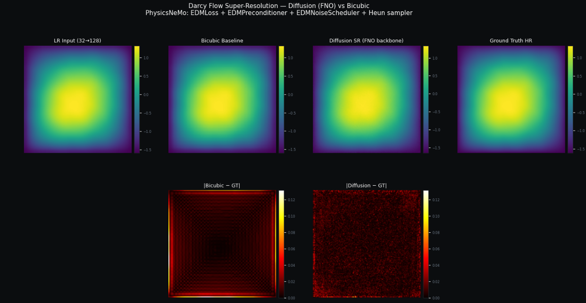
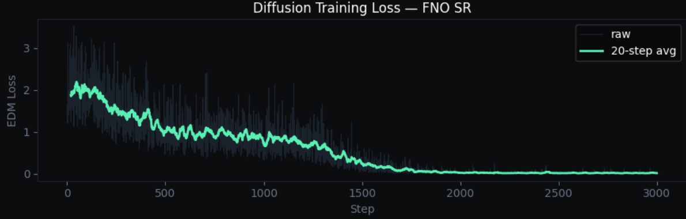

# Diffusion-Based Fluid Super-Resolution with NVIDIA PhysicsNeMo

Reconstructing high-resolution Darcy flow pressure fields from coarse 32x32 inputs using a conditional diffusion model. Built with NVIDIA's PhysicsNeMo diffusion module and a custom Fourier Neural Operator backbone.

**48.4% lower reconstruction error than bicubic interpolation. Ensemble of 8 samples achieves 61.4% improvement.**

---


*Left to right: coarse 32x32 input, bicubic baseline, diffusion reconstruction, ground truth. Bottom row: error maps for bicubic (left) and diffusion (right). Darker is better.*

---

## What This Project Does

Darcy flow describes how fluid moves through a porous medium. Given a permeability field (how porous each patch of material is), the goal is to predict the resulting pressure field. High-resolution simulations of this are expensive. This project trains a diffusion model to reconstruct a full 128x128 pressure field from a coarse 32x32 measurement, using NVIDIA's PhysicsNeMo library.

The key difference from classical super-resolution methods like bicubic interpolation: instead of smoothing between known values, the diffusion model learns the statistical distribution of what physically plausible pressure fields look like and generates from that distribution, conditioned on the coarse input.

---

## Results

| Method | Relative L2 Error |
|---|---|
| Bicubic interpolation | 0.0215 |
| Diffusion SR (single sample) | 0.0111 |
| Diffusion SR (ensemble mean, N=8) | 0.0083 |

Training: 3000 steps, single GPU, Google Colab.

---

## Ensemble: One Input, Many Reconstructions

Because the model is generative, you can run inference multiple times on the same input and get different but equally plausible reconstructions. The variance across samples gives a free uncertainty estimate.


*Left to right: coarse input, ensemble mean (N=8), per-pixel reconstruction uncertainty, ground truth. The uncertainty map shows where the model's reconstructions disagree, a spatial confidence estimate bicubic interpolation cannot provide.*

---

## Architecture

### Custom FNO Backbone

The denoising backbone is a Fourier Neural Operator registered with PhysicsNeMo by subclassing `physicsnemo.core.Module` directly.

```python
class FNODiffusionBackbone(PhysicsNeMoModule):
    def forward(self, x, t, condition=None, **kwargs):
        if condition is not None:
            x = torch.cat([x, condition], dim=1)   # channel-concat LR condition
        emb = self.sigma_emb(t)
        h   = self.lift(x)
        for block in self.blocks:
            h = block(h, emb)
        return self.proj(h)
```

The FNO operates in the frequency domain via 2D FFT, which lets it capture long-range spatial dependencies in the pressure field efficiently. The low-resolution conditioning signal is channel-concatenated to the noisy input.

**Parameters:** 4,312,705

### PhysicsNeMo Diffusion Components

| Component | Role |
|---|---|
| `EDMLoss` | Denoising score-matching training objective |
| `EDMPreconditioner` | Input/output rescaling across noise levels |
| `EDMNoiseScheduler` | Karras noise schedule + denoiser factory |
| `sample()` with Heun solver | 2nd-order ODE reverse diffusion sampler |

These are the real library components, not reimplementations.

### Conditioning

The low-resolution field is derived by downsampling each 128x128 pressure field to 32x32 and upsampling back with bilinear interpolation. This upsampled field is passed as `condition` at both training and inference time, channel-concatenated inside the backbone.

---

## Training


*Training loss over 3000 steps. The cosine learning rate schedule causes oscillation, which is expected. The overall trend is downward.*

```python
loss = loss_fn(model, hr, condition=lr_up).mean()
optimizer.zero_grad()
loss.backward()
torch.nn.utils.clip_grad_norm_(model.parameters(), 0.5)
optimizer.step()
```

- Optimizer: Adam, lr=5e-5
- Schedule: CosineAnnealingLR over 3000 steps
- Batch size: 4
- Resolution: 128x128

---

## Data

No dataset download required. PhysicsNeMo's `Darcy2D` datapipe generates random permeability/pressure pairs on the fly during training using NVIDIA Warp. Every batch is a freshly solved PDE instance.

```python
dataloader = Darcy2D(
    resolution=128,
    batch_size=4,
    nr_permeability_freq=5,
    normaliser=normaliser,
)
```

---

## Inference Pipeline

```python
# Bind LR condition to model
conditioned = partial(model, condition=lr_up)

# Convert to Denoiser via scheduler
denoiser = scheduler.get_denoiser(x0_predictor=conditioned)

# Initialise latent at sigma_max
t_steps = scheduler.timesteps(num_steps, device=device)
x_init  = scheduler.init_latents((1, HR, HR), t_steps[0].expand(B), device=device)

# Run reverse ODE
x_sr = sample(denoiser=denoiser, xN=x_init,
               noise_scheduler=scheduler, num_steps=40, solver='heun')
```

---

## Limitations

- 3000 training steps is short. A production surrogate would train significantly longer at higher resolution.
- The ensemble uncertainty is not formally calibrated — it is a relative confidence signal, not a probability.
- Single GPU at 128x128. PhysicsNeMo is designed for much larger multi-GPU workloads.

---

## Setup

```bash
pip install nvidia-physicsnemo warp-lang
```

Requires a CUDA-capable GPU. Tested on Google Colab T4/A100.

Open `physicsnemo_diffusion_sr.ipynb` in Google Colab and run top to bottom.

---

## Stack

- NVIDIA PhysicsNeMo 2.1.1
- PyTorch
- NVIDIA Warp
- Google Colab GPU

---

## Related

This is part of a series on uncertainty in physics surrogate models:

- [Lynx-Hare Diffusion Ensemble](https://github.com/ralegionc) — EDM diffusion from scratch on ecological time series
- [Darcy FNO + MC Dropout](https://github.com/ralegionc) — FNO surrogate with uncertainty quantification and OOD detection
- **This project** — generative super-resolution with PhysicsNeMo diffusion module

---

## Acknowledgements

Thanks to [Anas Farooqui](https://www.linkedin.com/in/anas-farooqui-5617b1244/) at NVIDIA for pointing toward the custom backbone interface documentation.
